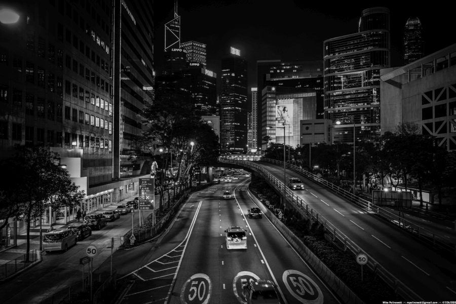

## Hi there 👋

### Repositories

### Top Languages

### ⚡ Fun facts:

✨ ¯\\_(ツ)_/¯ ✨

 
> My favorite clouds are greenish black Cumulonimbus. If I could get a hold of some cobra blood, I would drink it. I eat bacon, lettuce tomato sandwiches. My drug of choice is caffeine. I don´t believe in veganism.
> 
> I have done things for money I am ashamed of. I am fearless. I talk about pizza in a reverent, hushed tone. I believe Gandhi wasn´t a nice guy. I like caterpillars that keep it real and don't turn into butterflies.
> 
> My favorite holiday is Christmas. My standards are so high that I am not impressed by the Great Wall of China or NASA. The vastness of space makes me think we have to hurry up the development of warp drive technology. I believe global warming is better than cold war. And the cold war was more entertaining than modern television.
> 
> I don't believe in half ass, mediocrity or failure. I know sarcasm is the lowest form of humor but I still hold it dear to my heart. I believe that every IT professional understands the necessity to improve the accessibility of the internet. I also believe that most people with access to the internet aren´t using it right.
> 
> I once was told not to give to beggars and I stopped ever since – but I am not sure how I feel about that. I don't believe in sunglasses and tables below 75cm in height. I do believei n typos. If I watch a movie that doesn't have at least one explosion, I usually have the desire to drink wine – red wine, preferably a Merlot or Cabinet Sauvignon.
> 
> I am still bitter about having to learn French in school. I think the coolest place to be right now, would be {addLocation}. I travel a lot. I don´t believe in plans.

