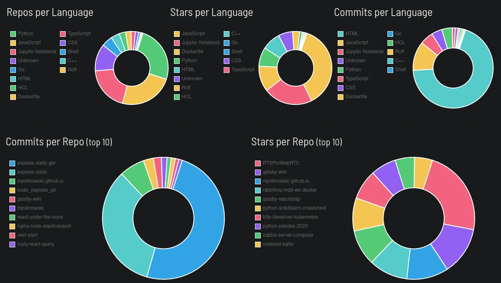
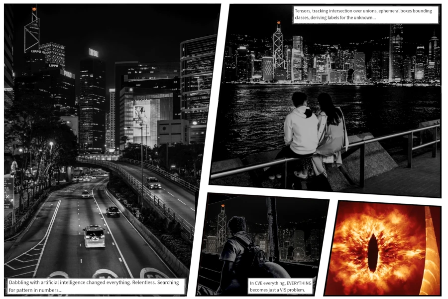

## Hi there 👋

### ⚡ Fun facts:

✨ ¯\\_(ツ)_/¯ ✨

 
> My favorite clouds are greenish black Cumulonimbus. If I could get a hold of some cobra blood, I would drink it. I eat bacon, lettuce tomato sandwiches. My fuel of choice is espresso at midnight. I don't believe in moderation. I heard that money can't buy happiness and I stopped listening ever since.
> 
> I have done things for money I am ashamed of. I am fearless. I discuss pizza in a solemn, church-like whisper. I believe Smeagol was mostly a victim of bad PR and shorter measuring tapes. I think dinosaurs peaked right before the meteor. Though, I am still bitter about how they ended Lost.
> 
> My favorite holiday is Christmas, when the dread sets in. My standards are so high that I am not impressed by the Great Wall of China or NASA. The vastness of space makes me think we have to hurry up the development of warp drive technology. I believe global warming is better than cold war. And the cold war was more dramatic than anything on Netflix.
> 
> I don't believe in talent, luck or work-life balance. I know sarcasm is the lowest form of humor but I still hold it dear to my heart. I believe that every IT professional understands the necessity to improve the accessibility of the internet. I also believe most people who own a smartphone are basically using it as a very expensive flashlight.
> 
> I once was told not to give to beggars and I stopped ever since – but I am not sure how I feel about that. I don't believe in horoscopes or paintings hung above the bed. I do believei n typos. If I watch a movie that doesn't have at least one explosion, I usually have the desire to drink wine – red wine, preferably a Merlot or Cabinet Sauvignon.
> 
> I think the coolest place to wake up tomorrow would be {addLocation}. I move around a lot. I don't believe in roots.

