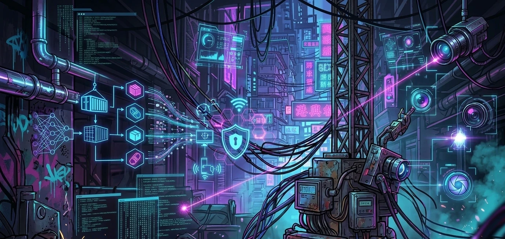
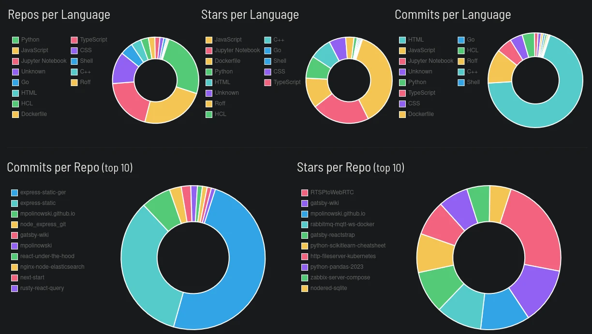
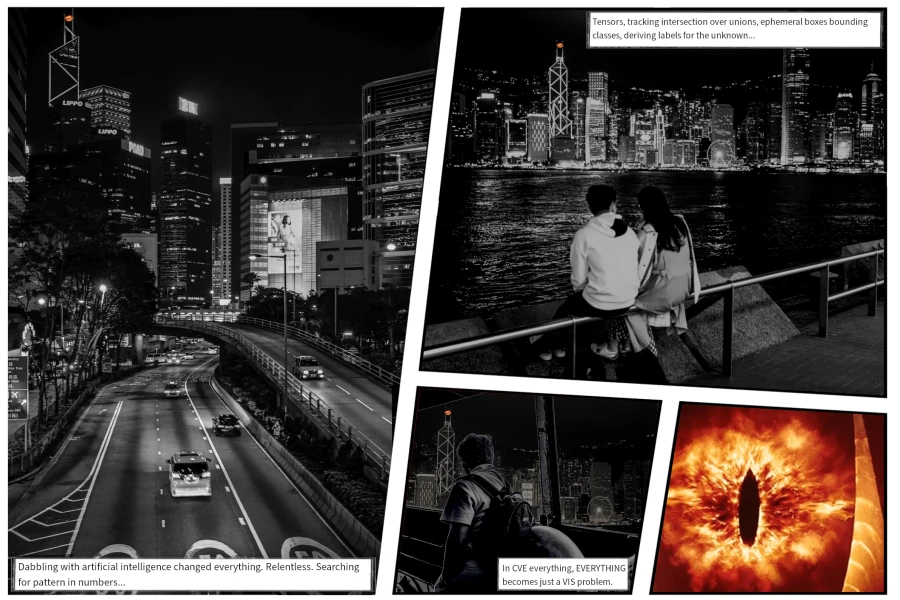

# Mike Polinowski

## Hi there 👋

**CTO INSTAR Deutschland (Waletech R&D) · DevOps / DevSecOps / MLOps · AI & Computer Vision**
*Plasma physics by education, bare-metal fleets by trade.*

> 16 years from the INSTAR Deutschland GmbH QA bench to the CTO chair. Last five: building CPU-constrained AI inference chains — YOLO → ANPR → VLM — on edge hardware and a 70+ node bare-metal cloud. Still the person to call when Home Assistant stops talking to the camera.

**Currently** — fine-tuning CPU-loving SmolVLM for security-scene description and engineering agentic solutions - locally hosted models, MCP interfaces, testing harnesses and retrieval augmented generation. Running bare-metal, continously deployed orchestration with rock-solid motoring and noise-free degradation notifications.

---

### 🚀 Featured Projects

*Three open repos, plus the production work behind them. Full write-ups live on the [portfolio](https://mpolinowski.github.io).*

| Project | What it is | Stack |
|:--|:--|:--|
| 🤖 **Instar Camera — MCP Server** · [repo →](https://github.com/mpolinowski/instar-mqtt-mcp) | Turns 700+ raw MQTT camera topics into **six clean, capability-level tools** any LLM agent can call — set a setting, read observed state, await a change, check health, pull the latest image, list capabilities. Built on FastMCP with a reconnect state machine, observed / known-but-stale / unknown state-confidence tracking so the agent reports only what it *confirmed*, and credentials held in env vars — never in the prompt or logs. One open-standard integration makes the camera drivable by Claude, Codex, Hermes and the open-source harnesses. |     |
| 🔍 **Instar Search Agent — Multimodal RAG** · [repo →](https://github.com/mpolinowski/instar-search-agent) | A **Specification-Driven Agentic Engineering** pipeline: a local corpus of 1,067 MDX articles (0–53 images each) normalized into a Hugging Face dataset, then embedded by a **frozen open-weight Nemotron VLM** into one 2,048-dim `.safetensors` index where text **and** image queries resolve against the same space. Two machine-checkable gate specs under `AGENTS.md` — named hard failures, `REPORT_*.json`, deterministic exit codes, byte-identical rebuilds — so "I use AI at work" becomes "here are the method, the code, and the proof it passes." |    |
| 📷 **Instar Object Detector — CPU-only Desktop CV** · [repo →](https://github.com/mpolinowski/instar-object-detector) | A **Tauri + Rust + React** desktop app that scans video, extracts the motion-event frame, then runs **two ONNX YOLO models in parallel on CPU** (object detection + instance segmentation through the pure-Rust `tract-onnx` runtime), overlaying motion regions, boxes and masks. Statically-linked FFmpeg, no Python, no GPU, no web server — a self-contained edge-inference binary with `rayon` parallelism. Proves I can do the whole CV path in systems code, not just Python. |     |

### 🏭 Selected Production Work

*CTO-level delivery at INSTAR Deutschland (Waletech R&D), 2015 → present. Private / client code — described here, not public.*

| System | Headline result | Keywords |
|:--|:--|:--|
| 🧠 **CPU-Only Cloud AI Inference Platform** | One serving stack replaced a multi-GPU stack: three resident model servers (YOLOv10 / LiteRT · Fast-Plate-OCR · fine-tuned SmolVLM) behind a Redis job queue, capped **Ray** actor pool, load-balanced across the fleet. ~**10× lower compute cost**, accuracy held, and the memory leaks / random crashes / multi-minute stalls are gone. **10,000+ detection tasks / min** in production. | MLOps · Distributed Systems · Ray · Redis · Observability · Nomad |
| 🎭 **Edge Vision-Language Model (SmolVLM)** | A VLM is a GPU-shaped tool; I had a CPU server and a hard latency budget. Fine-tuned on a security-scene dataset, primed by my YOLO detector's bounding boxes, exported to **OpenVINO**, served thread-safely with deterministic decoding + a 512-token budget + enforced-JSON output. | LLM · Multimodal · Fine-tuning · OpenVINO · Inference |
| 🎥 **Computer-Vision Engine — Edge to Cloud** | Owned end-to-end: benchmarked 5 architectures, grew **3 → 19 classes** from real customer complaint video, picked **YOLOv7 for edge / YOLOv10 for cloud**, exported **PyTorch → ONNX → quantized → Novatek firmware**, and closed the loop by feeding live complaints back into an MLflow pipeline until false positives *and* negatives dropped. | Computer Vision · YOLO · ONNX · Quantization · MLflow · MLOps |
| 🛠️ **Platform & SRE Backbone** | A 70+ bare-metal / VPS fleet across 10+ datacenters on **Nomad + Consul**: canary-first rollouts with auto-rollback, mTLS (cfssl CA), least-privilege Sentinel ACLs, single-path **GitLab CI/CD**, **Zabbix** / Kibana observability, TLS 1.3 / HSTS ingress, backup/restore, and a fleet-wide NTS/TLS time-sync service. | Platform Engineering · SRE · DevSecOps · Infrastructure as Code |
| 🔗 **IoT / Smart-Home Protocol Layer** | Designed **MQTT (MQTTv5, embedded broker + autodiscovery)** and webhook interfaces in firmware — to my knowledge making INSTAR the only surveillance-camera maker exposing its full control interface over MQTT. The foundation the MCP server above now builds on; still the first escalation contact years later. | IoT · MQTT · Embedded Linux · API Design · Smart Home |

> 📖 **Deep dives & written tutorials** — Node-RED, OpenHAB + MQTT, GitOps, Elasticsearch search design and more on the [portfolio](https://mpolinowski.github.io).

---

### ⚡ Fun facts:

✨ ``¯\_(ツ)_/¯`` ✨

> My favorite clouds are greenish black Cumulonimbus. If I could get a hold of some cobra blood, I would drink it. I eat bacon, lettuce tomato sandwiches. My fuel of choice is espresso at midnight. I don't believe in moderation. I heard that money can't buy happiness and I stopped listening ever since.
> 
> I have done things for money I am ashamed of. I am fearless. I discuss pizza in a solemn, church-like whisper. I believe Smeagol was mostly a victim of bad PR and shorter measuring tapes. I think dinosaurs peaked right before the meteor. Though, I am still bitter about how they ended Lost.
> 
> My favorite holiday is Christmas, when the dread sets in. My standards are so high that I am not impressed by the Great Wall of China or NASA. The vastness of space makes me think we have to hurry up the development of warp drive technology. I believe global warming is better than cold war. And the cold war was more dramatic than anything on Netflix.
> 
> I don't believe in talent, luck or work-life balance. I know sarcasm is the lowest form of humor but I still hold it dear to my heart. I believe that every IT professional understands the necessity to improve the accessibility of the internet. I also believe most people who own a smartphone are basically using it as a very expensive flashlight.
> 
> I once was told not to give to beggars and I stopped ever since – but I am not sure how I feel about that. I don't believe in horoscopes or paintings hung above the bed. I do believei n typos. If I watch a movie that doesn't have at least one explosion, I usually have the desire to drink wine – red wine, preferably a Merlot or Cabinet Sauvignon.
> 
> I think the coolest place to wake up tomorrow would be {addLocation}. I move around a lot. I don't believe in roots.

